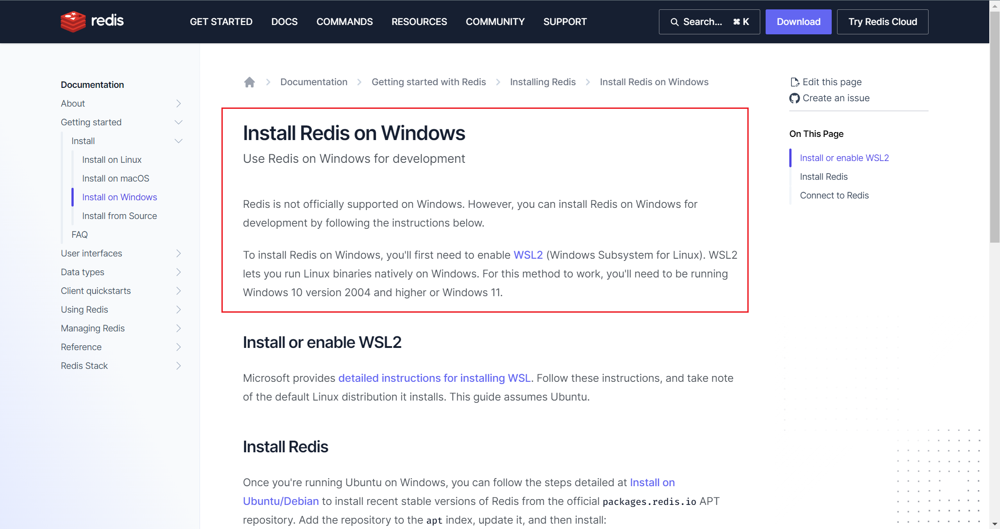
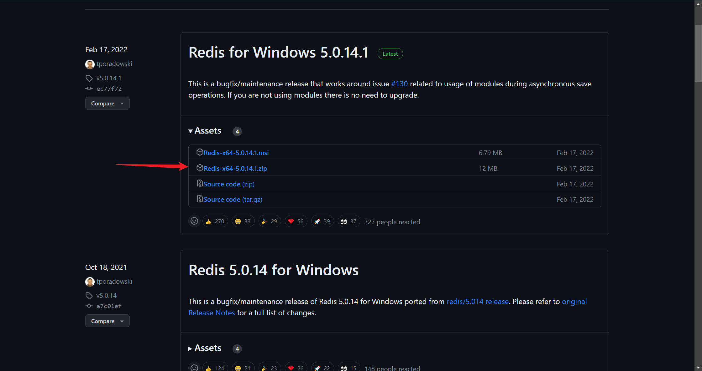
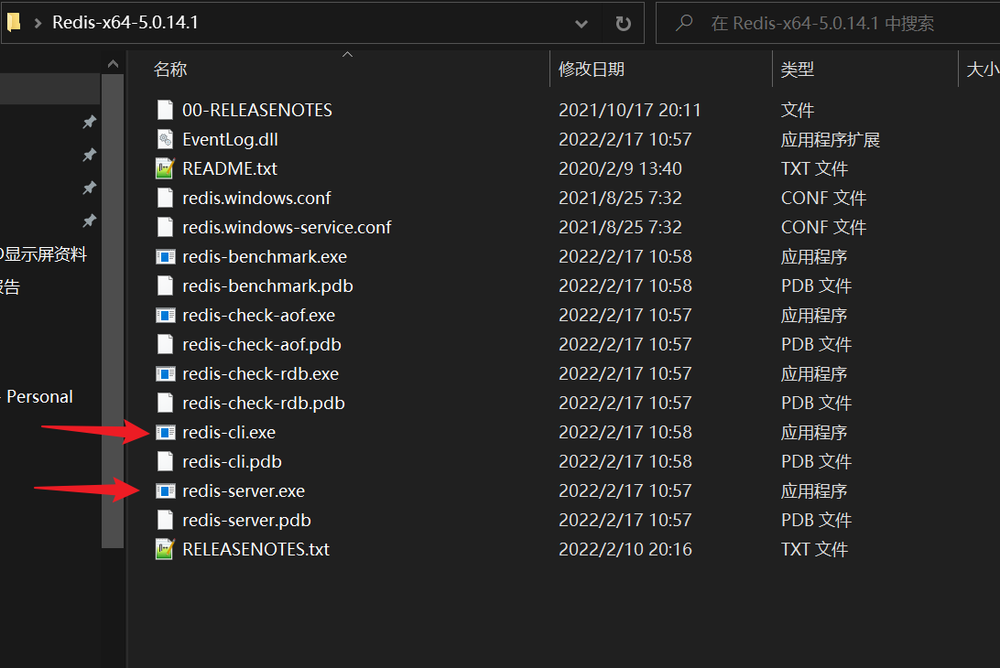
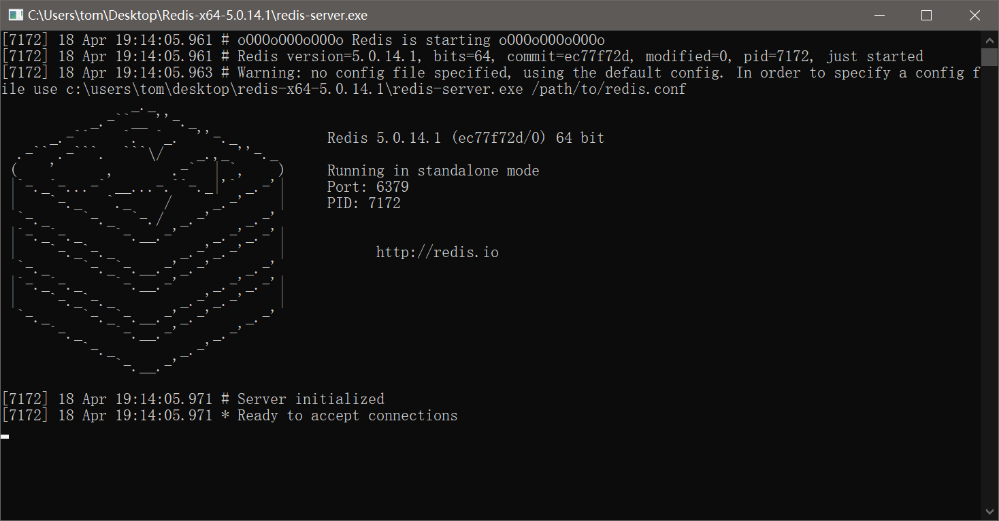
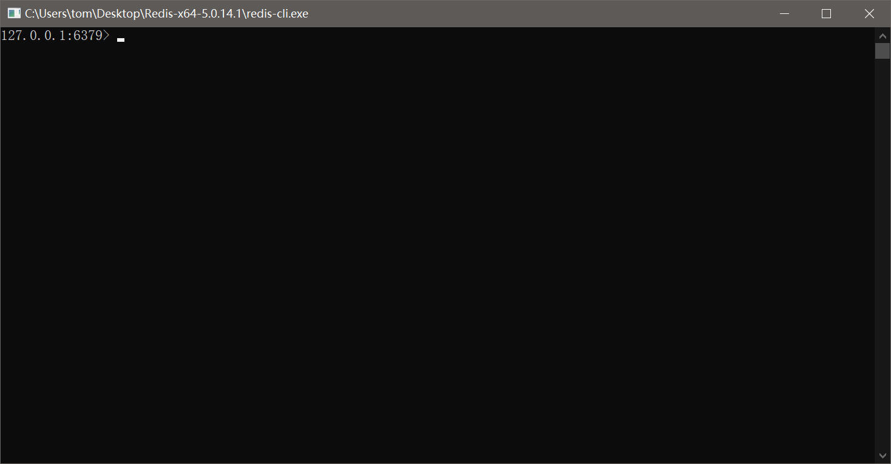
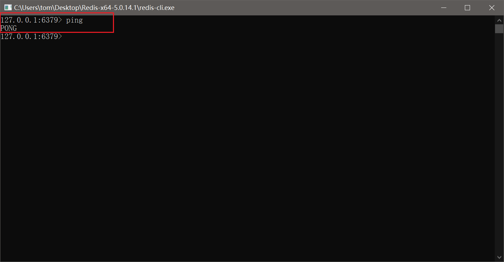
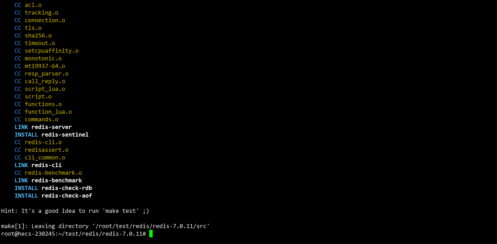

## redis是什么？

redis(Remote DIctionary Server)是互联网中最广泛使用的中间件之一，他是一个开源的 **key—value** 型数据库，
初学者可以将redis理解为 **数据结构服务器**。
具体的，redis在保存数据时是以 **键值对** 的形式存储的，
其中值可以是字符串、哈希、列表、集合或有序集合等数据结构，因此可以将其理解为一个数据结构服务器。

redis最广泛的应用场景是Cache，即做缓存。除此之外，它还可以用来session共享、消息队列等。

## redis特点

* 开源且代码非常简单优雅
* 编译安全非常简单，无任何系统依赖
* 社区活跃，各种语言广泛支持
* 高性能
* 是单线程模型（单线程仅仅是说在网络请求这一模块上用一个请求处理客户端的请求，像持久化它就会重开一个线程/进程去进行处理。）
* 支持持久化
* 支持事务
* 支持主从复制模式
* 具有原子性

## redis的安装

### windows下安装redis

redis的官网地址为： <https://redis.io/，官网上没有提供> windows 下的安装包，
而是建议直接使用 WSL2 来安装redis。



如果安装了 WSL2 可以直接参考linux下redis的安装方法直接安装，
如果没有 WSL2，可以在 [这里] (<https://github.com/tporadowski/redis/releases>) 下载适用于自己windows位数的压缩包，
直接解压即可。



> 也可使用 msi 安装包，傻瓜式安装即可，这里不做详细介绍。
>

解压得到文件夹内容如下：



其中比较重要的文件有：`redis-server.exe` 和 `redis-li.exe` 文件。
前者为redis服务端启动程序，后者为redis客户端启动程序。

双击 `redis-server.exe` 文件，可以启动redis服务端程序，启动后界面如下：



然后再双击 `redis-cli.exe` 文件，可以启动redis客户端程序，启动后界面如下：



输入命令 `ping` ，如果返回 `pong` ，说明已经安装成功。



### linux下安装redis

ubuntu系统下可以直接使用 `apt` 包管理工具直接安装redis。

```shell
# 更新
sudo apt update
# 安装redis
sudo apt install redis
# 安装完成后可以使用redis-server命令启动服务端、redis-cli启动客户端
redis-server
```

除了使用包管理工具自动安装，还可以使用源码直接安装redis。
从 [redis官网](https://redis.io/download/) 下载最新的redis源码，然后手动安装。

```shell
wget https://github.com/redis/redis/archive/7.0.11.tar.gz -O redis.7.0.11.tar.gz
tar -zxvf redis.7.0.11.tar.gz 
cd redis.7.0.11 
make
```

出现以下界面说明安装完成了。



安装完成后， `src` 目录下将会生成 `redis-server` 和 `redis-cli` 文件，
可以使用其启动redis服务端或客户端。

如果你想把 `redis-server` 和 `redis-cli` 等程序安装到 `/usr/local/bin` 目录下，
可以 `make` 改为 `make install` 命令。

## 连接redis服务

redis支持外部应用通过 **TCP连接和redis专属协议** 与redis服务端进行通信，
但同时redis也提供了客户端程序 `redis-cli` 来方便用户直接与redis服务端通信。

在windows上直接双击 `redis-cli.exe` 即可打开客户端，linux系统下可以输入命令 `redis-cli` 来启动客户端。

启动客户端后，他会尝试使用默认配置连接本地的redis服务端，因此在使用客户端之前需要先启动服务端。

如果想要连接其他的redis服务器，可以使用下面的命令

```shell
redis-cli -h host -p port -a password
# host为远端服务端地址，port为端口，password密码
# 默认配置为：
# host: localhost
# port: 6379
# password: 默认无密码，无需该参数
```

## redis数据类型

redis是一种存储数据结构的服务，因此在了解redis基础命令之前，有必要先熟悉一下redis中常用的数据结构。

### 字符串（Strings）

* 字符串与Java、Python等语言中的字符串含义一样，是一串字节组成的序列。
* 字符串是redis中最常用、最基础的数据类型。
* 在默认配置下，redis中单个字符最多能存储的数据量为512M。
* 字符串是二进制安全的。

### 列表（Lists）

* 列表是按照插入顺序排序的，多个字符串组成的链表。
* 单个列表中的最大元素数量为 `2^32 - 1 (4,294,967,295)`。
* 添加元素的时间复杂度为 $O(1)$ ，操作列表中元素的时间复杂度为 $O(n)$。

### 集合（Sets）

* 与Java、Python等语言相同，集合表示一组无序、不重复元素组成的序列。
* 支持集合常用的交并差等操作。
* 单个集合中的最大元素数量为 `2^32 - 1 (4,294,967,295)`。

### 哈希（Hashes）

* redis哈希是以键值对形式保存进行数据保存的数据结构。
* 大部分命令的时间复杂度为 $`(1)$ ， `HKEYS` 、 `HVALS` 、 `HGETALL` 时间复杂度为 $O(n)$ 。
* 单个哈希中的最大键值对数量为 `2^32 - 1 (4,294,967,295)`。

### 有序集合（Sorted Sets）

* 从字面意思就可以理解，有序集合是存在顺序的集合，其顺序体现在有序集合中的每个元素都有一个关联分数，有序集合会按分数对集合内元素排序，当存在分数相同的时候，按字典序排序。
* 大部分操作的复杂度都是 $O(n)$ ， `ZRANGE` 命令复杂度为 $O(log(n)+m)$ ， $m$ 具体含义后续介绍命令时会详细介绍。

除了上述5种最常用的数据类型之外，redis还支持 `Streams` 、 `Geospatial indexes` 、
`Bitmaps` 、 `Bitfields` 、 `HyperLogLog` 等数据类型，感兴趣的可以去 [redis数据类型](https://redis.io/docs/data-types/) 学习。

> 二进制安全是指它可以是任何二进制的序列，包含简单的字符串，甚至图片内容以及空字符等。
>

## redis 键（key）

前面介绍过，redis是以键值对的形式来保存数据的。关于键，有下面几点需要注意：

* 键是二进制安全的
* 键的内部数据结构是字符串
* 键不应该设置的太长或太短，设置的原则是尽可能使含义明确。

>
> ​    关于键的设置，有几个小技巧:
>
>     * 对于确实键很长的场景，可以进行hash处理，如 `sha1` 等；
>     * 巧用分号 `:` 可以使键的含义更明确，如 `user:1000:followers` 等。
>       之所以使用分号，是因为点 `.` 、下划线 `_` 、横杠 `-` 等其他分隔符在字符串中出现的概率更高。


## redis命令

### 键（key）

redis与键相关的命令如下：

|   命令    |                       描述                        |                            举例                             |
| :-------: | :-----------------------------------------------: | :---------------------------------------------------------: |
|    DEL    |             用于删除key，即删除键值对             |                       `DEL key_name`                        |
|   DUMP    |         序列化给定key，并返回被序列化的值         |                       `DUMP key_name`                       |
|  EXISTS   |                检查给定key是否存在                |                      `EXISTS key_name`                      |
|  EXPIRE   |               为给定key设置过期时间               |                    `EXPIRE key seconds`                     |
| EXPIREAT  | 用于为key设置过期时间，接受的时间参数是UNIX时间戳 |         `EXPIREAT key_name time_in_unix_timestamp`          |
|  PEXPIRE  |            设置key的过期时间，以毫秒计            |                 `PEXPIRE key milliseconds`                  |
| PEXPIREAT | 设置key过期时间的时间戳(unixtimestamp)，以毫秒计  | `PEXPIREAT key_name time_in_milliseconds_in_unix_timestamp` |
|   KEYS    |             查找所有符合给定模式的key             |                       `KEYS pattern`                        |
|   MOVE    |       将当前数据库的key移动到给定的数据库中       |            `MOVE key_name destination_database`             |
|  PERSIST  |      删除给定key的过期时间，使得key永不过期       |                     `PERSIST key_name`                      |
|   PTTL    |        以毫秒为单位返回key的剩余的过期时间        |                       `PTTL key_name`                       |
|    TTL    |       以秒为单位，返回给定key的剩余生存时间       |                       `TTL key_name`                        |
| RANDOMKEY |           从当前数据库中随机返回一个key           |                         `RANDOMKEY`                         |
|  RENAME   |                   修改key的名称                   |             `RENAME old_key_name new_key_name`              |
| RENAMENX  |        当newkey不存在时，将key改名为newkey        |            `RENAMENX old_key_name new_key_name`             |
|   TYPE    |              返回key所储存的值的类型              |                       `TYPE key_name`                       |
### 字符串（Strings）

字符串相关的命令如下：

|    命令     |                       描述                        |                      举例                       |
| :---------: | :-----------------------------------------------: | :---------------------------------------------: |
|     SET     |                  设置指定key的值                  |                 `SET key value`                 |
|     GET     |                  获取指定key的值                  |                    `GET key`                    |
|  GETRANGE   |        返回key中字符串值，并切片得到子字符        |          `GETRANGE key_name start end`          |
|   GETSET    | 将给定key的值设为value，并返回key的旧值(oldvalue) |             `GETSET key new_value`              |
|    MGET     |          获取所有(一个或多个)给定key的值          |              `MGET key1 ... keyN`               |
|    SETEX    |    设置key的值为value同时将过期时间设为seconds    |            `SETEX key seconds value`            |
|    SETNX    |           只有在key不存在时设置key的值            |                `SETNX key value`                |
|   STRLEN    |           返回key所储存的字符串值的长度           |                  `STRLEN key`                   |
|    MSET     |           同时设置一个或多个key-value对           | `MSET key1 value1 key2 value2 .. keyN valueN `  |
|   MSETNX    |   同时设置一个或多个key-value对，仅不存在时生效   | `MSETNX key1 value1 key2 value2 .. keyN valueN` |
|   PSETEX    |           以毫秒为单位设置key的生存时间           |         `PSETEX key milliseconds value`         |
|    INCR     |              将key中储存的数字值增一              |                   `INCR key`                    |
|   INCRBY    |    将key所储存的值加上给定的增量值(increment)     |                `INCRBY key num`                 |
| INCRBYFLOAT |  将key所储存的值加上给定的浮点增量值(increment)   |           `INCRBYFLOAT key float_num`           |
|    DECR     |              将key中储存的数字值减一              |                   `DECR key`                    |
|   DECRBY    |    将key所储存的值减去给定的减量值(decrement)     |                `DECRBY key num`                 |
|   APPEND    |          将value追加到key原来的值的末尾           |             `APPEND key new_value`              |

### 列表（lists）

列表相关的命令如下：

|    命令    |                                描述                                |                  举例                   |
| :--------: | :----------------------------------------------------------------: | :-------------------------------------: |
|   BLPOP    |                移出并获取列表的第一个元素（阻塞式）                | `BLPOP list1 [list2 ... listN] timeout` |
|   BRPOP    |               移出并获取列表的最后一个元素（阻塞式）               | `BRPOP list1 [list2 ... listN] timeout` |
| BRPOPLPUSH | 从列表中弹出一个值，并将该值插入到另外一个列表中并返回它（阻塞式） | `BRPOPLPUSH list another_list timeout ` |
|   LINDEX   |                      通过索引获取列表中的元素                      |           `LINDEX list index`           |
|  LINSERT   |                    在列表的元素前或者后插入元素                    |    `LINSERT list BEFORE pivot value`    |
|    LLEN    |                            获取列表长度                            |               `LLEN list`               |
|    LPOP    |                     移出并获取列表的第一个元素                     |               `LPOP list`               |
|   LPUSH    |                    将一个或多个值插入到列表头部                    |    `LPUSH list value1 [value2 ...]`     |
|   LPUSHX   |                   将一个值插入到已存在的列表头部                   |           `LPUSHX list value`           |
|   LRANGE   |                      获取列表指定范围内的元素                      |         `LRANGE list start end`         |
|    LREM    |                            移除列表元素                            |         `LREM list count value`         |
|    LSET    |                      通过索引设置列表元素的值                      |         `LSET list index value`         |
|   LTRIM    |                      对一个列表进行修剪(trim)                      |         `LTRIM list start end`          |
|    RPOP    |                     移除并获取列表最后一个元素                     |               `RPOP list`               |
| RPOPLPUSH  |      移除列表的最后一个元素，并将该元素添加到另一个列表并返回      |         `RPOPLPUSH list1 list2`         |
|   RPUSH    |                      在列表中添加一个或多个值                      |    `RPUSH list value1 [value2 ...]`     |
|   RPUSHX   |                        为已存在的列表添加值                        |    `RPUSHX list value1 [value2 ...]`    |

### 集合（sets）

集合相关的命令如下：

|    命令     |                     描述                     |                       举例                       |
| :---------: | :------------------------------------------: | :----------------------------------------------: |
|    SADD     |           向集合添加一个或多个成员           |          `SADD key value1 [value2 ...]`          |
|    SCARD    |              获取集合的成员数量              |                   `SCARD key`                    |
|    SDIFF    |            返回给定所有集合的差集            |                `SDIFF key1 key2`                 |
| SDIFFSTORE  | 返回给定所有集合的差集并存储在destination中  |            `SDIFFSTORE key key1 key2`            |
|   SINTER    |            返回给定所有集合的交集            |                `SINTER key1 key2`                |
| SINTERSTORE | 返回给定所有集合的交集并存储在destination中  |           `SINTERSTORE key key1 key2`            |
|  SISMEMBER  |       判断value元素是否是集合key的成员       |              `SISMEMBER key member`              |
|  SMEMBERS   |             返回集合中的所有成员             |                  `SMEMBERS key`                  |
|    SMOVE    | 将value元素从source集合移动到destination集合 |          `SMOVE src_key dis_key value`           |
|    SPOP     |        移除并返回集合中的一个随机元素        |                    `SPOP key`                    |
| SRANDMEMBER |          返回集合中一个或多个随机数          |                `SRANDMEMBER key`                 |
|    SREM     |           移除集合中一个或多个成员           |                 `SREM key value`                 |
|   SUNION    |            返回所有给定集合的并集            |                `SUNION key1 key2`                |
| SUNIONSTORE |  所有给定集合的并集存储在destination集合中   |           `SUNIONSTORE key key1 key2`            |
|    SSCAN    |               迭代集合中的元素               | `SSCAN key cursor [MATCH pattern] [COUNT count]` |


### 哈希（hashs）

集合相关的命令如下：

|     命令     |                         描述                         |                       举例                       |
| :----------: | :--------------------------------------------------: | :----------------------------------------------: |
|     HDEL     |               删除一个或多个哈希表字段               |                    `HDEL key`                    |
|   HEXISTS    |         查看哈希表key中，指定的字段是否存在          |        `HEXISTS key field1 [field2 ...]`         |
|     HGET     |            获取存储在哈希表中指定字段的值            |                 `HGET key field`                 |
|   HGETALL    |         获取在哈希表中指定key的所有字段和值          |                  `HGETALL key`                   |
|   HINCRBY    |   为哈希表key中的指定字段的整数值加上增量increment   |             `HINCRBY key field num`              |
| HINCRBYFLOAT |  为哈希表key中的指定字段的浮点数值加上增量increment  |        `HINCRBYFLOAT key field float_num`        |
|    HKEYS     |                获取所有哈希表中的字段                |                   `HKEYS key`                    |
|     HLEN     |                获取哈希表中字段的数量                |                    `HLEN key`                    |
|    HMGET     |                 获取所有给定字段的值                 |            `HMGET key field1 field2`             |
|    HMSET     |   同时将多个field-value(域-值)对设置到哈希表key中    |     `HMSET key field1 value1 field2 value2`      |
|     HSET     |        将哈希表key中的字段field的值设为value         |              `HSET key field value`              |
|    HSETNX    |     只有在字段field不存在时，设置哈希表字段的值      |             `HSETNX key field value`             |
|    HVALS     |                  获取哈希表中所有值                  |                   `HVALS key`                    |
|    HSCAN     |                 迭代哈希表中的键值对                 | `HSCAN key cursor [MATCH pattern] [COUNT count]` |
|   HSTRLEN    | 返回哈希表key中，与给定域field相关联的值的字符串长度 |               `HSTRLEN key field`                |

### 有序集合（sorted sets）

集合相关的命令如下：

|       命令       |                                描述                                |                     举例                     |
| :--------------: | :----------------------------------------------------------------: | :------------------------------------------: |
|       ZADD       |       向有序集合添加一个或多个成员，或者更新已存在成员的分数       | `ZADD key score1 value1 [score2 value2 ...]` |
|      ZCARD       |                        获取有序集合的成员数                        |                 `ZCARD key`                  |
|      ZCOUNT      |                计算在有序集合中指定区间分数的成员数                |             `ZCOUNT key min max`             |
|     ZINCRBY      |            有序集合中对指定成员的分数加上增量increment             |        `ZINCRBY key increment member`        |
|   ZINTERSTORE    | 计算给定的一个或多个有序集的交集并将结果集存储在新的有序集合key中  |   `ZINTERSTORE key num_keys key1 key2 ...`   |
|    ZLEXCOUNT     |               在有序集合中计算指定字典区间内成员数量               |           `ZLEXCOUNT key min max`            |
|      ZRANGE      |             通过索引区间返回有序集合成指定区间内的成员             |            `ZRANGE key start end`            |
|   ZRANGEBYLEX    |                   通过字典区间返回有序集合的成员                   |          `ZRANGEBYLEX key min max`           |
|  ZRANGEBYSCORE   |                通过分数返回有序集合指定区间内的成员                |         `ZRANGEBYSCORE key min max`          |
|      ZRANK       |                    返回有序集合中指定成员的索引                    |              `ZRANK key value`               |
|       ZREM       |                   移除有序集合中的一个或多个成员                   |               `ZREM key value`               |
|  ZREMRANGEBYLEX  |               移除有序集合中给定的字典区间的所有成员               |         `ZREMRANGEBYLEX key min max`         |
| ZREMRANGEBYRANK  |               移除有序集合中给定的排名区间的所有成员               |       `ZREMRANGEBYRANK key start end`        |
| ZREMRANGEBYSCORE |               移除有序集合中给定的分数区间的所有成员               |        `ZREMRANGEBYSCORE key min max`        |
|    ZREVRANGE     |        返回有序集中指定区间内的成员，通过索引，分数从高到底        |          `ZREVRANGE key start end`           |
| ZREVRANGEBYSCORE |         返回有序集中指定分数区间内的成员，分数从高到低排序         |        `ZREVRANGEBYSCORE key min max`        |
|     ZREVRANK     | 返回有序集合中指定成员的排名，有序集成员按分数值递减(从大到小)排序 |             `ZREVRANK key value`             |
|      ZSCORE      |                     返回有序集中，成员的分数值                     |              `ZSCORE key value`              |
|   ZUNIONSTORE    |           计算一个或多个有序集的并集，并存储在新的key中            |   `ZUNIONSTORE key num_keys key1 key2 ...`   |
|      ZSCAN       |           迭代有序集合中的元素（包括元素成员和元素分值）           |                 `ZSCAN key`                  |


## 参考

* <https://www.redis.com.cn/tutorial.html>
* <https://redis.io/docs/getting-started/>
